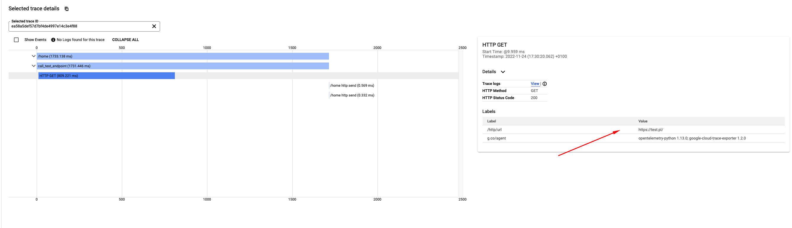
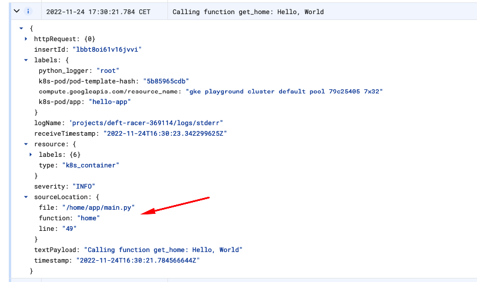

# gke-opentelemetry-setup

## Steps to setup tracing with OpenTelemetry

* Enable Cloud Trace API in GCP
* Cluster service account needs `roles/cloudtrace.agent` role or create new service account
* Install OpenTelemetry operator: 
```bash
kubectl apply -f https://github.com/open-telemetry/opentelemetry-operator/releases/download/v0.60.0/opentelemetry-operator.yaml
```
* Deploy Collector, there are options to deploy it as sidecar or as separate pod
```bash
kubectl apply -f collector-config.yaml
```
* As an option we can also install auto-instrumentator and we do not have to make changes to code but customization is limited. To make it work we have to annotate our pods with `k apply -f collector-config.yaml`

* [Docs to check how we can setup traces](https://google-cloud-opentelemetry.readthedocs.io/en/latest/index.html)


* Check repository for additional [Opentelemetry instrumentation](https://github.com/open-telemetry/opentelemetry-python-contrib/tree/main/instrumentation) options for example: 
 - `celery`
 - `django`
 - `aiohttp`
 - `sqlalchemy`

This instrumentators can enhance our tracing for specific libraries.

```python
import logging
import httpx

from google.cloud import logging as gcp_logging
from fastapi import FastAPI
from fastapi.middleware.cors import CORSMiddleware
from opentelemetry.instrumentation.fastapi import FastAPIInstrumentor
from opentelemetry.instrumentation.httpx import HTTPXClientInstrumentor
from opentelemetry import trace
from opentelemetry.exporter.cloud_trace import CloudTraceSpanExporter
from opentelemetry.sdk.trace import TracerProvider
from opentelemetry.sdk.trace.export import BatchSpanProcessor

logging_client = gcp_logging.Client()
logging_client.setup_logging()

tracer_provider = TracerProvider()
cloud_trace_exporter = CloudTraceSpanExporter()
tracer_provider.add_span_processor(
    BatchSpanProcessor(cloud_trace_exporter)
)
trace.set_tracer_provider(tracer_provider)
tracer = trace.get_tracer(__name__)


app = FastAPI()

app.add_middleware(
    CORSMiddleware,
    allow_origins=["*"],
    allow_credentials=True,
    allow_methods=["*"],
    allow_headers=["*"],
)


FastAPIInstrumentor.instrument_app(app)
HTTPXClientInstrumentor().instrument()


@app.get("/home")
async def home():
    with tracer.start_as_current_span("call_test_endpoint") as current_span:
        async with httpx.AsyncClient() as client:
            r = await client.get("https://test.pl/")
        logging.info(f"Received response {r}")
        current_span.add_event(name="get_home")
        home = await get_home()
        logging.info(f"Calling function get_home: {home}")
        return home


async def get_home():
    data_dict = {"hello": "world"}
    logging.info("message field", extra={"json_fields": data_dict})
    return "Hello, World"
```
## Logging

We can also improve our logging with google sdk. We can add additional data in a structured way.

* https://cloud.google.com/logging/docs/reference/libraries#logging_write_log_entry_advanced-go
* https://cloud.google.com/logging/docs/reference/v2/rest/v2/LogEntry#httprequest/

